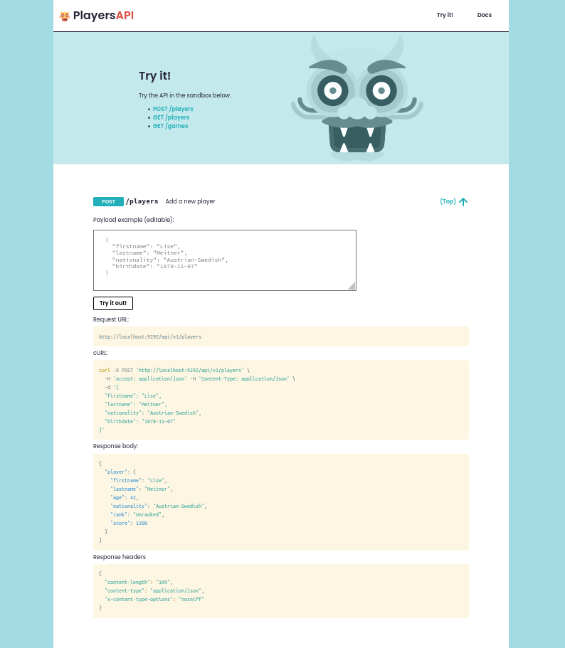

[](https://gitlab.com/octopusinvitro/players-api/commits/master)
[](https://coveralls.io/github/octopusinvitro/players-api?branch=main)
[](https://codeclimate.com/github/octopusinvitro/players-api/maintainability)
[](https://depfu.com/github/octopusinvitro/players-api?project_id=34744)


# Readme

API for player management, with docs and a playground. See it at https://roleplayersapi.herokuapp.com/




## Project settings

* Optionally, turn your repo on in Coveralls (coverage status), codeclimate (maintainability), and depfu (dependency status).
* If you are using codeclimate, update the default branch name in the settings area.

**Folder structure:**

* `assets`: Dev assets
* `public`: Compiled assets
* `bin`: Executables
* `lib`: Sources
* `spec`: Tests
* `views`: Webapp views


## How to use this project

This is a Ruby project. Tell your Ruby version manager to set your local Ruby version to the one specified in the `Gemfile`.

For example, if you are using [rbenv](https://cbednarski.com/articles/installing-ruby/):

1. Install the Ruby version: `rbenv install < VERSION >`
1. Install the `bundler` gem, which will allow you to install the rest of the dependencies listed in the `Gemfile` of this project.

  ```bash
  gem install bundler
  rbenv rehash
  ```


### Project setup

1. Download Jasmine standalone ZIP file from [the releases page](https://github.com/jasmine/jasmine/releases) and copy the `lib` folder into `assets/js/`.

1. Install dependencies:
  ```bash
  bundle install
  npm install
  ```

1. Run the app and the tests to check that everything works (see sections below)

1. Syntax highlighting uses [prism.js by Lea Verou](https://prismjs.com/download.html).
  If changes are needed on the `prism.js` and `prism.scss` files in the `assets` folder, copy the URL at the top of the `prism.js` file and paste it in a browser. Add or remove options as needed and redownload the two files.

Optionally, install Heroku CLI tool, create an app and configure it:

```bash
sudo snap install heroku --classic
heroku login
heroku create roleplayersapi
heroku buildpacks:add --index 1 heroku/ruby
heroku buildpacks:add --index 2 heroku/nodejs
```

Then you can use it like this:

```bash
git push heroku main
heroku open
```

**Custom rake tasks:**

* `bundle exec rake assets`: Build assets (compile sass, join and minify JS and CSS files)
* `bundle exec rake watch`: Like `assets` plus rebuilds assets on change and serves JS tests

**Useful Heroku commands:**

* `heroku config`: List ENV vars
* `heroku logs --tail`: Check the logs
* `heroku run bash`: Run a remote shell in your local machine (`heroku run COMMAND` for any command)

**Other commands:**
* `bundle exec pry`: Open a Ruby prompt
* `binding.pry`: Drop it anywhere you want to insert a debug breakpoint


### To run the app

```bash
bundle exec rake assets
bundle exec puma
```

and go to http://localhost:9292/

Optionally you can also use `bundle exec rackup` or `heroku local web` and port **5000**.


## Frontend tests

```bash
bundle exec rake watch
```

and go to http://localhost:4000/tests/


## Backend tests


### To run all tests and rubocop

```bash
bundle exec rake
```


### To run a specific test file or unit test

```bash
bundle exec rspec path/to/test/file.rb
bundle exec rspec path/to/test/file.rb:TESTLINENUMBER
```


### To run rubocop

```bash
bundle exec rubocop
```


## License

[](https://opensource.org/licenses/mit)
MIT License
